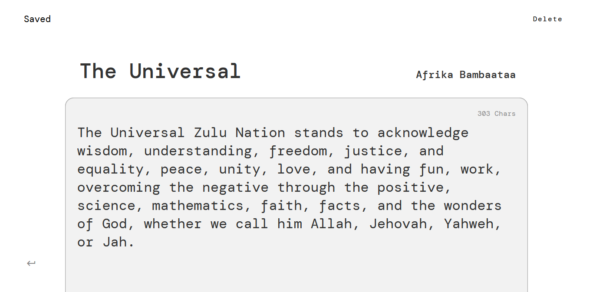

# Notes App built on Angular

### Description  

This project was built on Angular and the idea is to create a simple notes app that a   llows users to create, edit and delete notes. Also the application will use as a fake backend a json-server that will be used to store the notes. 

### Wireframes


### Setup

To run this project first you new to clone the repository and then install the dependencies with 

```
npm install
```

inside of the client folder and then on the server folder. Once you have installed the dependencies you can run the json server with 

```
npm run start
```
on the server folder and then run the angular app with 

```
ng serve -o
```

on the client folder.

### Technologies

This project was built with different technologies such as:
* Angular
* Angular Material
* Json-server
* Rxjs
The project was also written on TypeScript. 


### Final Product

Based on the wireframes of the final product we've tried to make something that gets close to the wireframes.

##### Homepage


##### Edit note


##### Create note


### As a future feature...

 we would like to add a login page and a register page so that users can create an account and then login to the app. Also we would like to add a search bar so that users can search for notes.

 ### Resources

* [Angular](https://angular.io/)
* [Angular Material](https://material.angular.io/)
* [Json-server](https://www.npmjs.com/package/json-server)
* [MDN](https://developer.mozilla.org/en-US/)
 
 ### Authors

 I'm Cristian Sánchez. I'm a Frontend developer, I study microcomputers and networks. I lived Spain and I'm 17 years old. I'm a self-taught developer. I'm also learning about backend technologies such as Node.js and Express.js. 

 Here is my [LinkedIn](https://www.linkedin.com/in/cristian-sanchez-dev) and my [GitHub](https://github.com/sanchez-cristian)